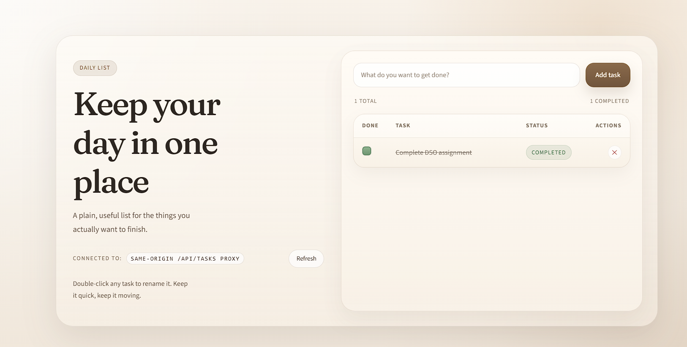
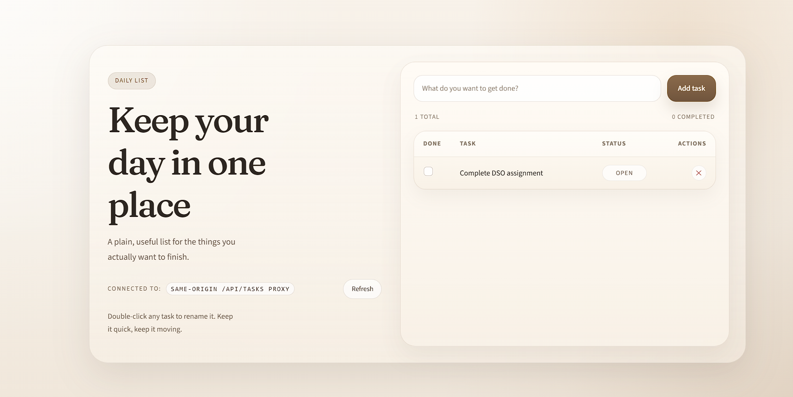
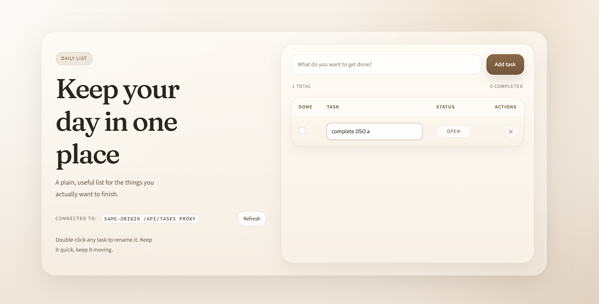
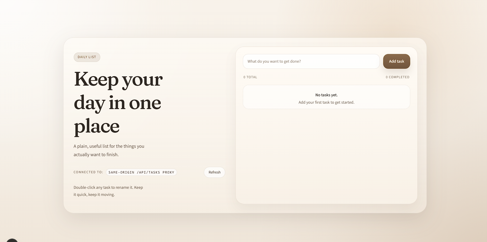

# Assignment 1 Report

This is a short report of the steps I took to finish the task.

## Step 0

### 1. Read

I opened the app and checked the empty task board first.

### 2. Create

I added a new task using the input box and the Add task button.

### 3. Update

I updated the task by marking it as completed.

### 4. Delete

I deleted the task and the board went back to the empty state.

##

## PART A

