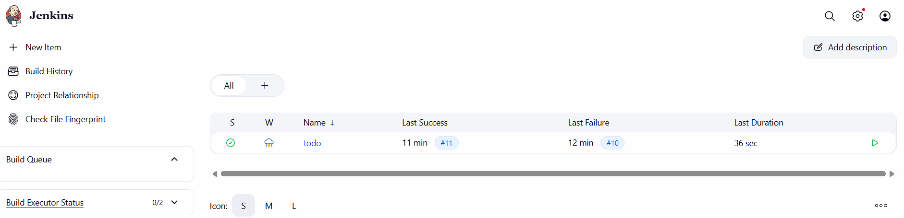
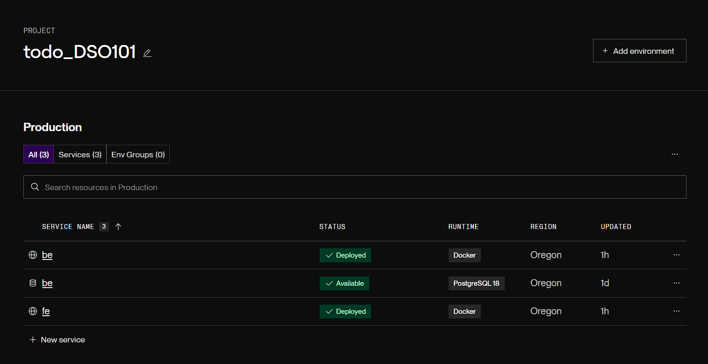

# Assignment 2 Report

## What I did

I set up the Jenkins pipeline to pull the GitHub repo, install backend packages in `be`, build the project, and deploy the app.

## Pipeline setup

The Jenkinsfile uses Node.js 20.x, runs `npm install` in `be`, then runs `npm run build`.

I also followed the required test setup idea below:

```json
{
  "scripts": {
    "test": "jest --ci --reporters=default --reporters=jest-junit",
    "build": "tsc || webpack || next build"
  }
}
```

Install commands:

```bash
npm install --save-dev jest
npm install --save-dev jest-junit
```

## Results

The pipeline finished successfully in Jenkins.

## Links

- GitHub repo with Jenkinsfile: [https://github.com/Zhennue/YesheyZhennue_02240372_DSO101_A1](https://github.com/Zhennue/YesheyZhennue_02240372_DSO101_A1).
- Docker Hub image link: .

## Screenshots

- Successful pipeline execution: .
- Test results in Jenkins: [text](screenshots/test-result.txt).
- Render successful deployment of fe and be: .

## Challenges

There was no separate backend test suite, so the build step was used as the verification step in Jenkins.