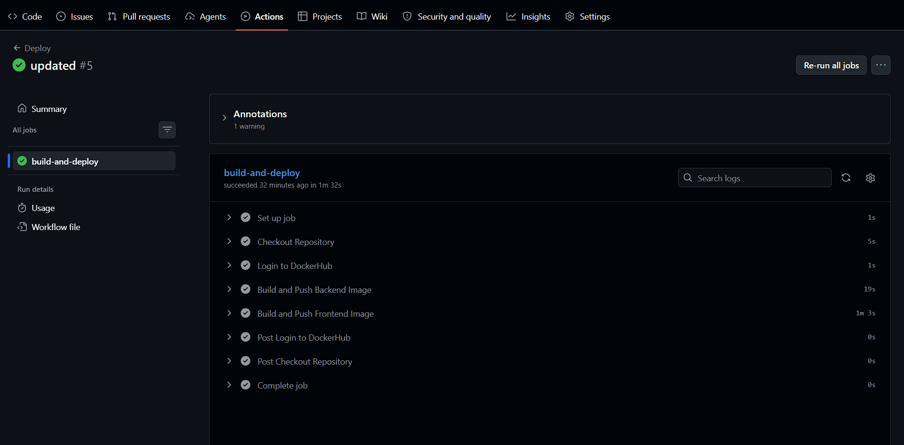
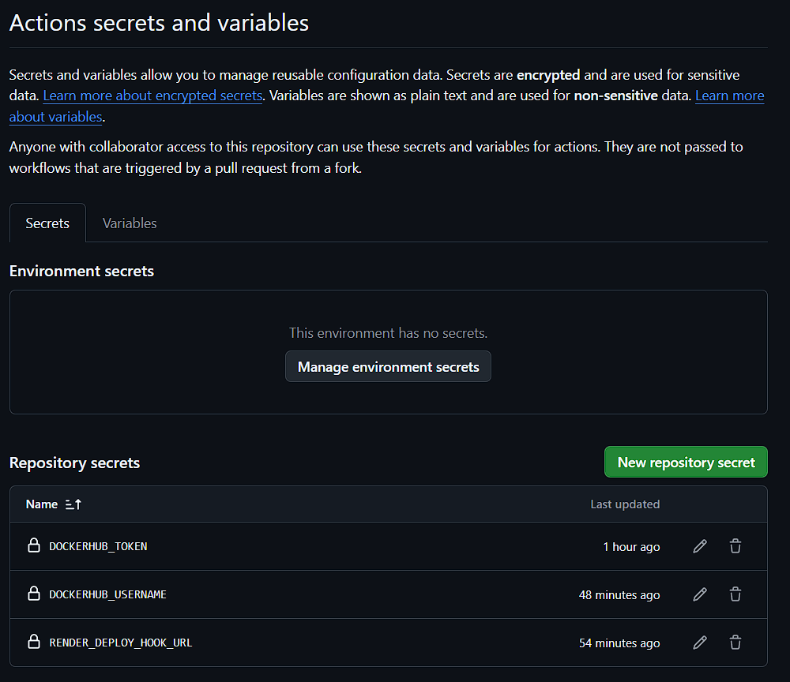

# Assignment 3 Report

## Steps Taken

- Fixed the GitHub Actions workflow in `.github/workflows/deploy.yml`.
- Added the required repository secrets for Docker Hub and Render.
- Verified the workflow ran successfully after the fixes.

## Challenges Faced

- The workflow had YAML indentation issues.
- The Render webhook returned a 404, so the deploy step had to be removed.
- The workflow also needed to match the real Docker build locations.

## Learning Outcomes

- GitHub Actions is very strict about YAML indentation.
- Render blueprint deployment can work without a webhook trigger.
- CI/CD depends on correct secret names and service URLs.

## Screenshots

### GitHub Actions Run

### Repository Secrets

## Render Deployment Link

- Backend: https://yesheyzhennue-02240372-dso101-a1.onrender.com
- Frontend: https://yesheyzhennue-02240372-dso101-a1-jeng.onrender.com