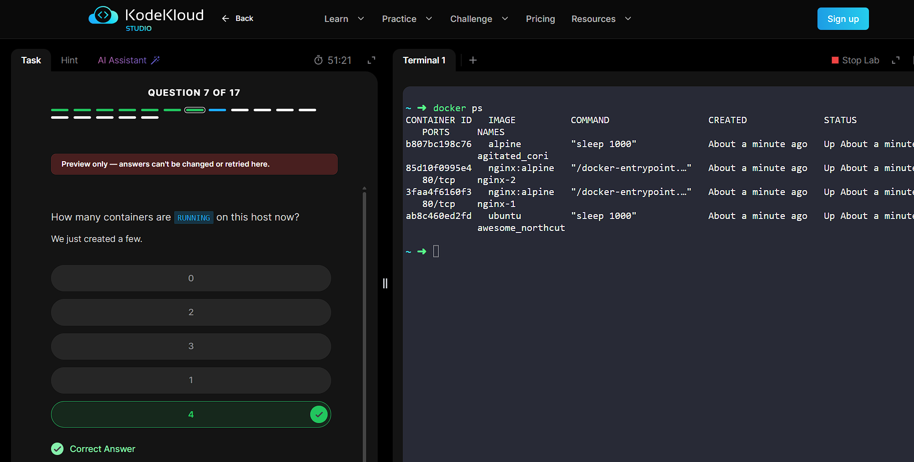

# Practical Report: Basic Docker Commands in KodeKloud

## Introduction

In this practical activity, I learned and practiced the basic Docker commands in the KodeKloud lab. The main purpose of this task was to understand how to check the Docker version, view containers, view images, run containers, pull images, and remove containers or images.

## Work Done

I started by checking the Docker Server Engine version on the host using `docker -v`. After that, I used `docker ps` and `docker ps -a` to see the running and stopped containers.

I also used `docker images` to list the images available on the host. Then I practiced pulling a new image with `docker pull nginx:1.14-alpine` and running a container with `docker run -d --name webapp nginx:1.14-alpine`.

Later, I learned how to remove an image using `docker rmi ubuntu` and how to delete containers with `docker rm`. I also used `docker kill` when a running container had to be stopped before deleting it.

## What I Learned

This practical helped me understand the difference between images and containers. I also learned that a container can be running or stopped, and that `docker ps` shows only running containers while `docker ps -a` shows all containers.

The lab was useful because it showed the commands in a real terminal and helped me connect the Docker theory with hands-on practice.

## Screenshots

### Screenshot Gallery

All screenshots collected during the practical are included below.

## Conclusion

Overall, this practical gave me a clear introduction to Docker basics. I now understand how to inspect the Docker environment, create and manage containers, and handle Docker images using simple commands.
